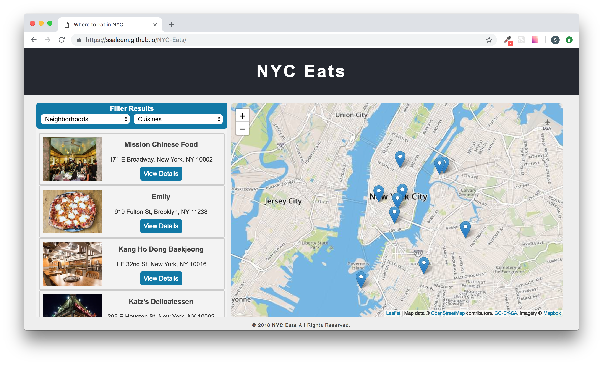
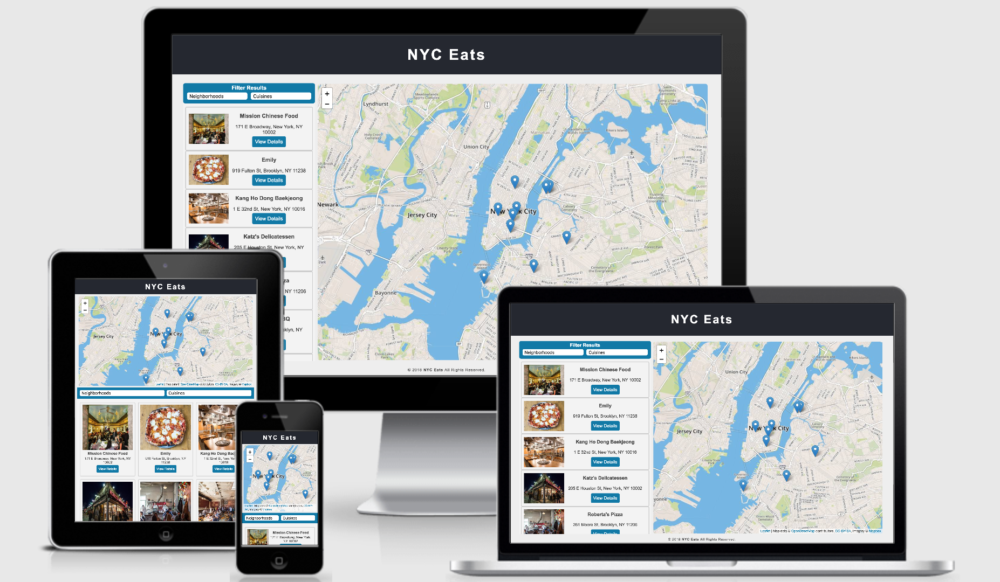

# NYC Eats
This project is part of [Udacity](https://www.udacity.com/)'s Front end Nanodegree. The purpose of this project is to transform an existing application with static design that lacks accessibility into a **responsive, offline-first, and accessibility complying** web application. 

This application uses [leafletjs](https://leafletjs.com/) with [Mapbox](https://www.mapbox.com/) to show NYC restaurants on map along with their details including address, hours and reviews. The project is based on starter code and assets from [this repository](https://github.com/udacity/mws-restaurant-stage-1). 
<!--  -->

## Contents
- [Features Implemented](#features-implemented)
- [Built/optimized with](#built/optimized-with)
- [Live Version](#live-version)
- [About Lighthouse Audit](#about-lighthouse-audit)

## Features Implemented

### Responsive Design
The design is transformed to achieve responsiveness on different devices. CSS Flexbox along with media queries and responsive images are used to adapt the layout across different screen sizes.

### Offline-First

Offline-First is a development approach in which applications are built such that an application’s core features are able to function with or without an internet connection. In this project _caching_ is used to provide a seamless offline experience for the users.

A service worker(`sw.js`) is employed to locally caches all requests for the site’s assets so that any page that has been visited by a user will be accessible when the user is offline. More specifically, at the time of installation, the service worker creates a cache for storing assets(request/response pairs). Service worker also has a `fetch` event listener, which performs following steps everytime a `fetch` event is fired.
- Check whether a match for the request is found in the CacheStorage. If so, serve that.
- If not, `fetch` the request from the network, then also open the cache created in the service worker installation step and add a clone of the request to the cache using `(cache.put(event.request, response.clone()))`
        
### Accessibility
Application accessibility for screen reader use is improved by making DOM order logical as well using `label` tags and semantic html elements.

## Built/optimized with
- [Service Worker API](https://developer.mozilla.org/en-US/docs/Web/API/Service_Worker_API) - An event-driven web worker registered against an origin and a path. It can control the web page/site it is associated with, intercepting and modifying navigation and resource requests, and caching resources.
- [CacheStorage](https://developer.mozilla.org/en-US/docs/Web/API/CacheStorage) - An interface that provides a master directory of all the named caches that can be accessed by a ServiceWorker or other type of worker or `window` scope.
- [Cache](https://developer.mozilla.org/en-US/docs/Web/API/Cache) - Provides a storage mechanism for Request/Response object pairs that are cached, for example as part of the ServiceWorker life cycle.
- [Fetch API](https://developer.mozilla.org/en-US/docs/Web/API/Fetch_API) - An interface for fetching resources.
- [CSS Flexbox](https://www.w3schools.com/css/css3_flexbox.asp) - CSS layout module to design flexible responsive layout structure without using float or positioning.
- [CSS Media Queries](https://www.w3schools.com/css/css3_mediaqueries.asp) - A popular technique to deliver a tailored style sheet to desktops, laptops, tablets, and mobile phones by defining different style rules for different media types.
- [Grunt](https://gruntjs.com/) Plugins - grunt-contrib-imagemin, grunt-responsive-images

## Live Version
Live version of this app can be found [here](https://ssaleem.github.io/NYC-Eats/).

## About Lighthouse Audit
Audit scores are generated by
-  Lighthouse 3.2.0
-  Throttling: Simulated Fast 3G, 4x CPU Slowdown
-  score = min(Mobile audit score, Desktop audit score)

